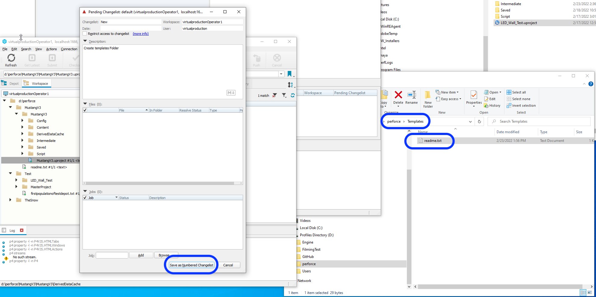
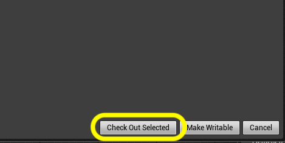

# Unreal 5.4 Base Setup

[Video Tutorial for this Guide](https://lsu.box.com/s/anu8l2jft0rj86zz7cat78a1zdz18mqn)

---

##### Step 1.

Run the **Epic Games Launcher** and run the latest version of Unreal. Selet the **Film / Video & Live Events** project category. Select a **Blank** template. Select a directory to save the project to and give the project a name. I named mine `My Project`.  Select a `Blank` **project**. I selected **No** **Starter Content** and we will use **Lumen** instead of **Ray Tracing** as no special hardware is required. Press the <kbd>Create</kbd> button. 

##### Step 2.

We need to download two external plugins. **[OptiTrack](https://optitrack.com/support/downloads/plugins.html)** for the **Live Link** support in **Motive** that handles camera tracking. For focus we are using **LOLED Indie Mark[]** encoders which require a server to be installed as well as a plugin for Unreal **[Lonet 2 - Live Link](https://loledvirtual.com/documentation/software-downloads/files)**.

##### Step 3.

Create a new folder under the project folder name it `Plugins` then move the downloaded plugins into it.

##### Step 4.

Open up **Edit | Plugins** and enable the **ICVFX** plugin. This plugin is a collection of other virtual production related plugins that are needed.

Also double check that the following plugins are enabled: **LONET2 Plugin**, **OptiTrack - Live Link**, and **OptiTrack - Streaming Client**. They should be already enabled since they are included in the Plugins director.

You will need to restart the engine for this to take place.

##### Step 5.

Make sure **SwitchBoardListener is running**.  You can find it in **D:\Program Files\Epic Games\UE4_5.0\Engine\Binaries\Win64\SwitchboardListener.exe**.  Creata a shortcut for the desktop.  Run it.

##### Step 6.

Double click and run the **SwitchboardListener** shortcut. Now you know if it working by making sure the terminal does not display any errors.  This looks good.

##### Step 7. **[You should ask perforce admin for this step]**

OK, we need to quit Unreal and set up a **Perforce Depot** (Project).  Either add to an existing Depot or create a new one in the **Admin** interface.  Use a normal **Local** depot. I called mine `Templates` with a project folder called `LSUBaseTemplate`. 

##### Step 8.

Now we need to add a `.p4ignore` file.  You can download it here [.p4ignore](../files/.p4ignore). This allows us to indicate folders and files that will not be included in the repo as they are generated sepearately at run-time on each machine. Include it in the root folder with the `.uproject` file and the root folder of both plugins.

 

##### Step 9.

Now we need to add this new depot to a existing workspace. Right click on the **Workspaces** in **P4V**. Right click on the workspace and select **Edit Workspace 'name of workspace'**. Then a window pops up and select **Include Tree**. Then select <kbd>Get Latest</kbd> button. or you can make a new workspace and choose the depot stream that have made for your project.

##### Step 10.

Select `.p4ignore` and press **Add** to add the file to the repository.  Select the **Pending** tab and submit the **Changelist**. Enter a message and submit the changelist.

##### Step 11.

Click on the **Templates** folder and select `Reconcile Offline Work...`.  Then **Submit** the changelist with a comment.

##### Step 12.

Now launch the game from **P4V** by double clicking an launching Unreal from the interface and not from the explorer or through Epics tools.

##### Step 13.

If all works well the source control will default to being connected. You can also activate Source Control in the Content Browser. To do so, right-click any asset or folder. At the bottom of the context menu, in the Source Control section, click Connect to Source Control.

Connect to Source Control

This will open a log-in screen where you can select your source-control system and enter any appropriate settings and other information.

Source Control Login

Enter the appropriate information, and click Accept Settings. After source control is activated, the display of the assets in the Content Browser will change to reflect their source-control status, and some source-control options will be included on the right-click context menu.

##### Step 14.

Now you will create two folders `Stage` and `Scenes`.  The stage folder will have all the elements we need for our XR stage.  The scenes folder will contain all the scenes we are going to use in this project.  Go back to the top **Content** folder and drag **Main** into the **Scenes** folder.  You will get a warning about moving this level (but since we have done nothing to it it is OK to ignore), press the <kbd>Yes</kbd> button.

##### Step 15.

Now when you go to save, if you have not checked out the file you will be prompted to 
**Check out Selected**. NEVER select **Make Writable**.  This should never be used.  The only reason a file can't be checked out is if someone else is using it.  Just ask that person to check it back in so you can access it. In this case select **Check Out Selected** (any time you try and save an existing non-checked out asset).

##### Step 16.

Right-click on the **Content** folder and select **Fix Up Redirectors in Folder**.

##### Step 17.

Now we want to the source control to check out files as they are being edited.  So this way you don't have surprises after an hour or so working on a level that it is locked and can't be saved.

Go to **Edit | Project Settings** and go to the Editor tab, go to the Source control and checked Prompt for checkout on change.

___

| [home](../README.md#user-content-gms2-background-tiles--sprites---table-of-contents) | [next](../2-ndisplay5.4-Config/README.md)|
|---|---|
